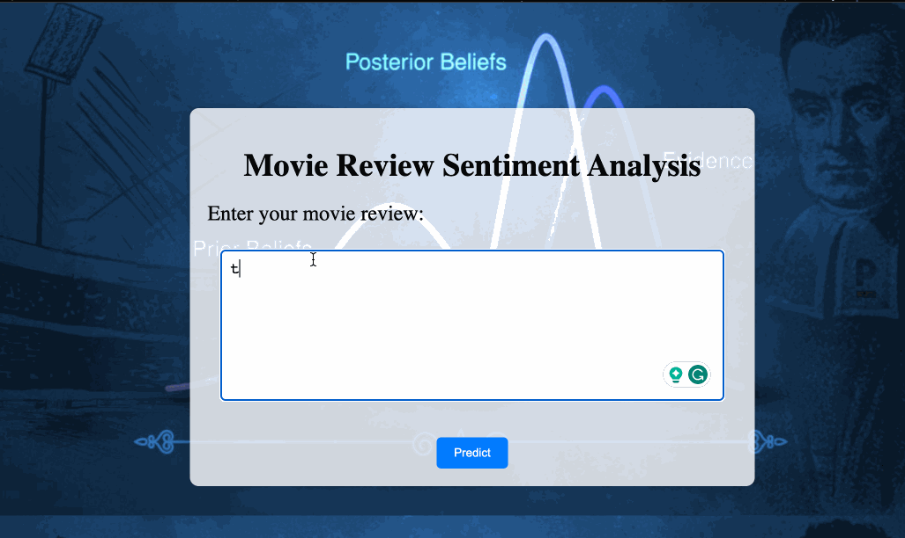

# *Bayesian Movie Review Sentiment Analysis Program*
A machine learning model that predicts the sentiment of a movie into positives and negatives using the Naive Bayes Classification Algorithm

## Video Walkthrough

Here's a walkthrough of simple web interface I made using Flask to allow users to input their own movie reviews and receive
sentiment predictions in real-time:

GIF created with [LiceCap](http://www.cockos.com/licecap/).

